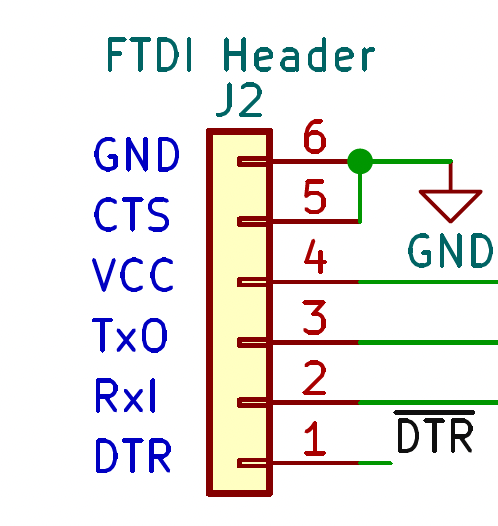
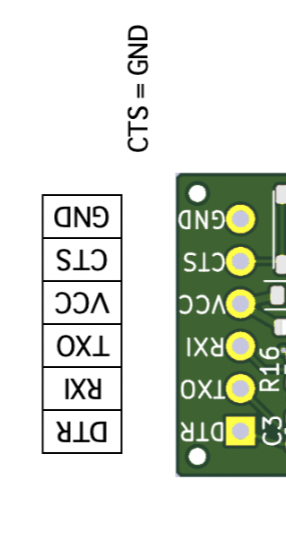
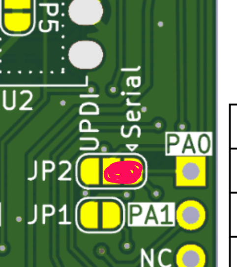
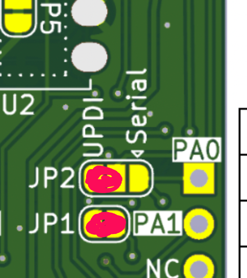
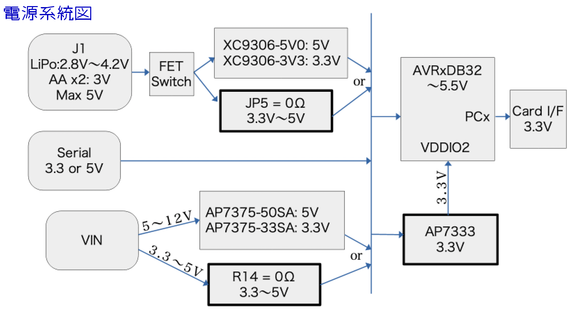
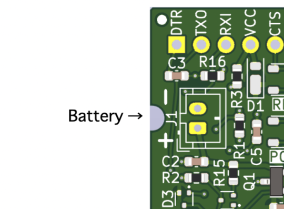
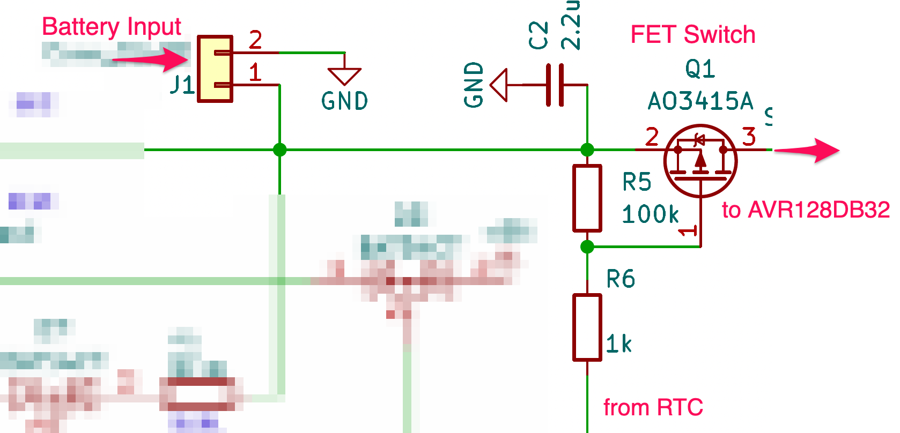
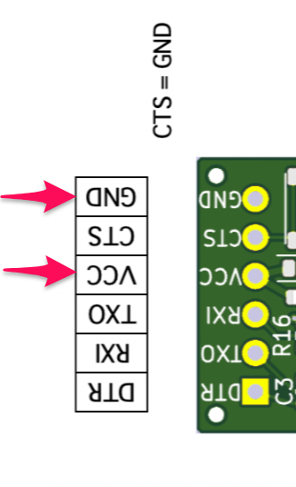
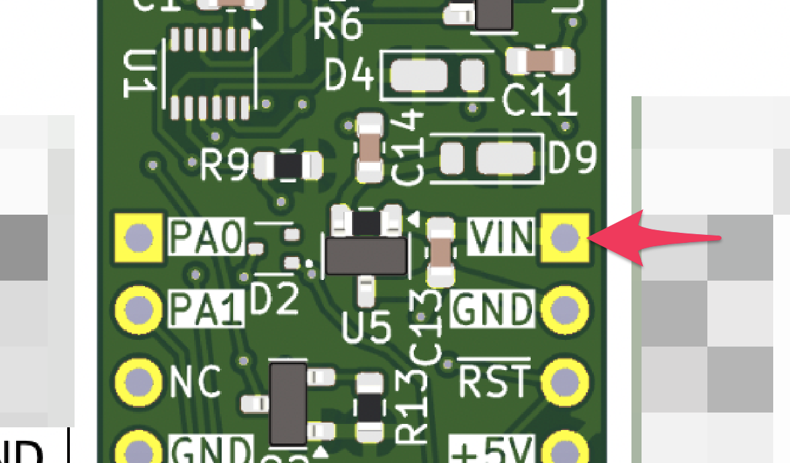

# AVR128DB32 microcontroller board

This is an AVR128DB32 microcontroller board that can be programmed using Arduino IDE. It is equipped with a real-time clock circuit that can be turned on and off at will by programming, making it ideal for battery-powered applications that collect sensor information at set times.

Arduino IDEでプログラミングできるAVR128DB32マイコン基板です。プログラムで自分自身の電源を任意にOn/Off可能なリアルタイムクロック回路を備えています。決まった時刻毎にセンサー情報を収集するバッテリー駆動のアプリケーションなどに最適です。
  
  

## ピン配置
  

## 特徴
- Arduino IDEでプログラミング可能。Arduino PRO Miniの様にUSB-Serial I/FでPCと繋いでプログラミング可能です(ブートローダー書き込み済み)。 
  

     &nbsp;&nbsp; 
  

  初期状態はシリアルが選択されていますが、ブートローダーを使わないUPDI書き込みも選択可能です。 
  

     &nbsp;&nbsp;&nbsp;&nbsp; 
  

  ボードマネージャは [DxCore](https://github.com/SpenceKonde/DxCore/blob/master/README.md) を使用。 
  動作確認済みの設定(BODなし、ブートローダー有、AVR128DB32、24MHz internal、MVIO有効、printfでfloatを扱う、等)：
  

- リアルタイムクロック(RTC) [RX8035](https://akizukidenshi.com/goodsaffix/rx-8035_am.pdf)搭載。I2Cでプログラム可能です。
   
  RTCのバックアップに超小型Li２次電池 [MS621](https://akizukidenshi.com/catalog/goods/search.aspx?search=x&keyword=ms621&search=search) を裏面に搭載可能です。電源が供給されている時に充電されます。
- マイクロSDカードコネクター搭載、電源はLDO [AP7333](https://akizukidenshi.com/goodsaffix/ap7333.pdf)で3.3Vを供給しています。I/Fは、Port Cを使ったSPIを使用しています（ SPI.swap(SPI1_SWAP_DEFAULT); を設定）。AVR***DB32シリーズのPort Cにはレベルシフタが内蔵されており、VDDIO2に3.3Vを供給することで、3.3VのロジックレベルでのSPI通信を可能です。
  https://github.com/SpenceKonde/DxCore/tree/master/megaavr/libraries/SPI
- マイコンの電源をRTCからON/OFF制御可能です。ON/OFFはFETスイッチで行うので、OFFの時マイコンの消費電力は0です！
- 電源入力は３系統あります。全てダイオードORされています。マイクロSDカードを使うには3.3V以上の電源電圧が必要です。
  

     
  

  - J1（バッテリー入力）から : 電源電圧は2.6Vから5.5Vです。Liバッテリー×1セルで動作可能。J1からの電源はRTCでON/OFF制御可能です。また、POWERボタンを長押しすると電源をONするようにプログラム可能です。サンプルプログラムを参照してください。2.5Vから3VでSDカードを使いたい場合は、裏面JP5をカットし、[buck-boost_converter](https://akizukidenshi.com/catalog/g/g116055/) を裏面に実装してください。 
    

       &nbsp;&nbsp;&nbsp;&nbsp; 
    

  - シリアル（Serial）から : 電源電圧は2.6Vから5.5Vです。マイコンに接続されています。 
    

      
    

  - VINから : 電源電圧は2.6Vから5.5Vです。初期状態ではU5の1ピンと2ピンにR14が実装されています。これを外してSOT23タイプのLDO [AP7375](https://akizukidenshi.com/goodsaffix/ap7375.pdf)を実装することで、クルマの12Vバッテリーなどの電圧（Max 45V）も使用可能になります（ただし消費電力に注意）。 
    

      
    

- ボードサイズ 95mm x 18.2mm、付属のピンヘッダをハンダ付けすればブレッドボードで使用できるスリム設計です。ピンヘッダをボードの おもて面に実装し、裏返して使用することも可能。この場合、リセットボタンとPOWERボタン、それからLEDも裏面実装可能です。どちらのボード面にもピン情報がシルク印刷してあり使いやすい。

## スペック
- プログラムメモリは128KB、RAMは16KB、内蔵のクロックは24MHzです。
- 12ビットのADC、10ビットのDAC、OPアンプ、ロジック回路を装備しています。
- 詳細は [Datasheet](https://ww1.microchip.com/downloads/en/DeviceDoc/AVR128DB28-32-48-64-DataSheet-DS40002247A.pdf) 参照。

## 使用例
 

## 回路図
* [schematics](schematics/AVRT_2.pdf)

