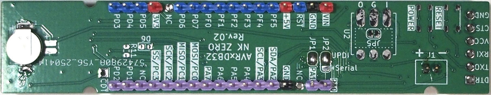

# AVR128DB32 microcontroller board

This is an AVR128DB32 microcontroller board that can be programmed using Arduino IDE. It is equipped with a real-time clock circuit that can be turned on and off at will by programming, making it ideal for battery-powered applications that collect sensor information at set times.

Arduino IDEでプログラミングできるAVR128DB32マイコン基板です。プログラムで自分自身の電源を任意にOn/Off可能なリアルタイムクロック回路を備えており、決まった時刻毎にセンサー情報を収集するバッテリー駆動のアプリケーションなどに最適です。
  
  

特徴
- Arduino IDEでプログラミング可能
- I2C制御のリアルタイムクロック(RTC)回路搭載。プログラムで自身の電源をOn/Off可能です。
- 動作電圧が広い→2.6Vから5.5V。Liバッテリー×1セルでも動作可能。LDO追加すれば15V入力可能です（消費電力注意）。
- マイクロSDカードコネクター搭載（3.3V以上の電源電圧が必要です）
  マイクロSDカードI/Fは、Port Cを使ったSPI通信を使用しています（ SPI.swap(SPI1_SWAP_DEFAULT); を設定）。AVR***DB32シリーズのPort Cにはレベルシフタが内蔵されており、VDDIO2に3.3Vを供給することでSDカード用3.3VのロジックレベルでのSPI通信ができます。
  https://github.com/SpenceKonde/DxCore/tree/master/megaavr/libraries/SPI
- RTCのバックアップに超小型Li２次電池MS621を搭載可能。電源が供給されている時に充電されます。
- ブートローダー書き込み済みなのでArduino PRO Miniの様にUSB-Serial I/Fでプログラミング可能
  （UPDI書き込みも選択可能です）
- 付属のピンヘッダをハンダ付けすればブレッドボードで使用できるスリム設計です。

スペック
- プログラムメモリは128KB、RAMは16KB、内蔵のクロックは24MHzです。
- 12ビットのADC、10ビットのDAC、OPアンプ、ロジック回路を装備しています。

  

---
 
---

* [schematics](schematics/AVRT_2.pdf)

---
